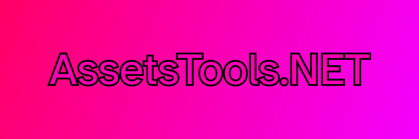

# AssetsTools.NET v3

A .NET library for reading and modifying Unity assets and bundles based off of the AssetsTools library from [UABE](https://github.com/SeriousCache/UABE/)'s AssetsTools library.

Jump to a tool:

# AssetsTools.NET

  

[Documentation and examples can be found on the wiki](https://github.com/nesrak1/AssetsTools.NET/wiki).

AssetsTools.NET allows you to read and write assets files and bundles files.